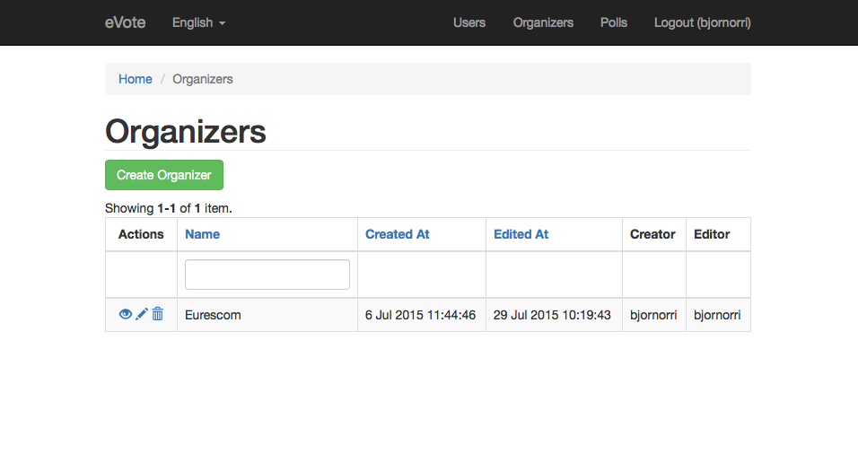
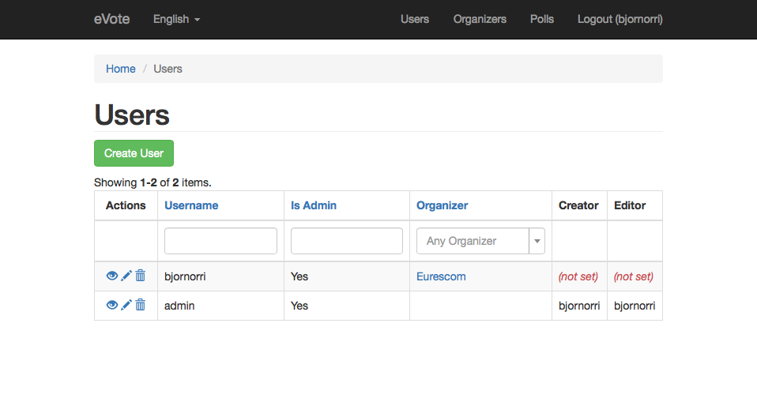
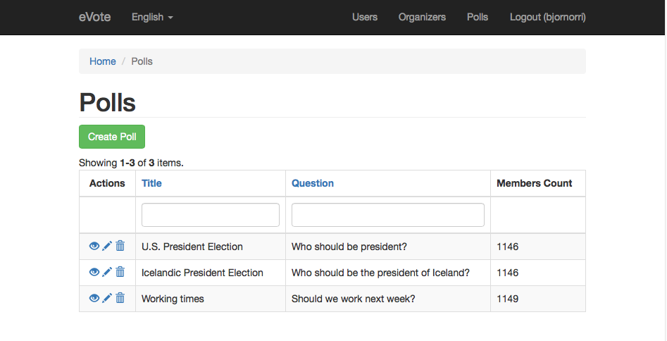
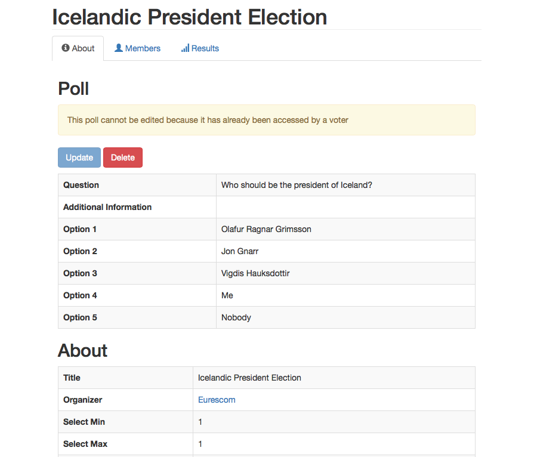
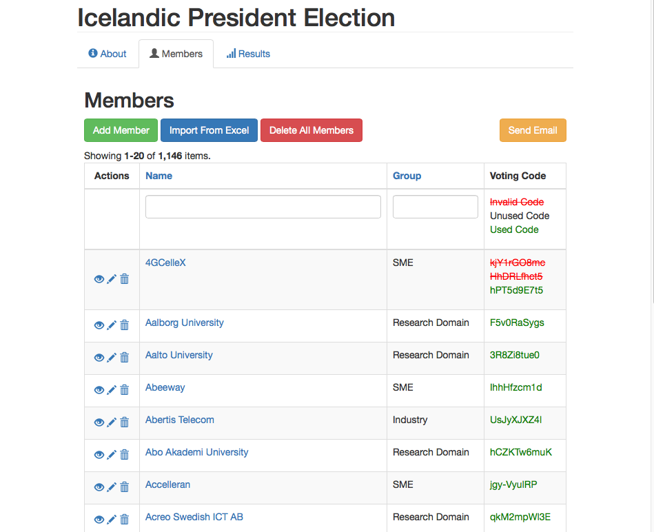
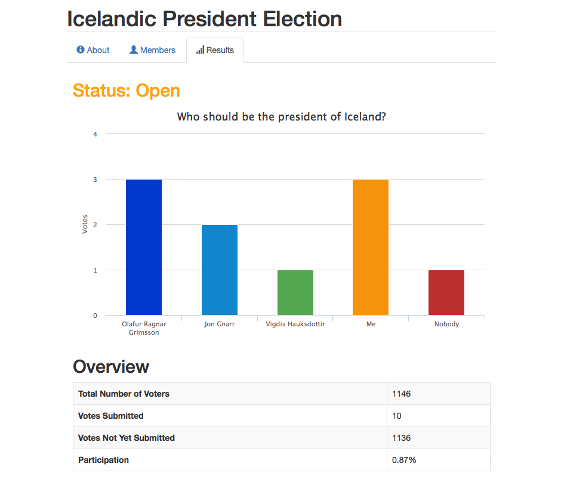

# Documentation

## Website

### Organizations

An organization is an entity that is responsible for managing polls. Organizations can be created and edited by an admin user.

### Users

A user can be associated with an organization. If a user is associated with an organization, he is able to perform poll management tasks on behalf of th  organization. A user can also be marked as an administrator, in which case he is able to perform administrative actions.

### Polls

A poll can be created by any user that is associated with an organization.

On the poll page there are 3 tabs.

#### About
This tab provides information about the poll, including its query and its options.

#### Members
This tab provides an overview of the members (voters) of the poll. Here you can see which voting codes have been used, invalidate voting codes and issue new ones. This is also the place where one should create/import members and send emails to them.

#### Results
This tab provides information about the current standings of the poll. If the poll is over this would be the result of the poll.

## API

The web application provides an API that can be used to retrieve a poll and submit a vote.

### Endpoints
The API provides the following endpoints.

#### GET /v1/poll/get
This endpoint requires the `token` URL parameter to be set to a valid voting code.

**_Example Request_**:

    curl -X GET "localhost:82/v1/poll/get?token=EhH7KraJ0g"

**_Example Response_**

    {
      "success": true,
      "data": {
        "title": "Icelandic President Election",
        "question": "Who should be the president of Iceland?",
        "info": "",
        "select_min": 1,
        "select_max": 1,
        "start_time": "2015-07-17 08:25:00",
        "end_time": "2015-08-19 10:00:00",
        "options": [
          {
            "id": 27,
            "text": "Olafur Ragnar Grimsson"
          },
          {
            "id": 28,
            "text": "Jon Gnarr"
          },
          {
            "id": 29,
            "text": "Vigdis Hauksdottir"
          },
          {
            "id": 48,
            "text": "Me"
          },
          {
            "id": 49,
            "text": "Nobody"
          }
        ],
        "organizer": {
          "name": "Eurescom",
          "email": "eurescom@eurescom.eu"
        }
      }
    }

#### POST /v1/vote/submit
This endpoint requires the `token` URL parameter to be set to a valid voting code. The IDs of the options selected by the voter should be sent as an array in the request body.

**_Example Request_**:

    curl -X POST \
    -H "Content-Type: application/json" \
    -d '{"options": [48]}' \
    "localhost:82/v1/vote/submit?token=EhH7KraJ0g"

**_Example Response_**

    {
      "success": true,
      "data": {
        "options": [
          48
        ]
      }
    }

## Apps

The [EuresTools Github page](https://github.com/EuresTools) contains an [iOS project](https://github.com/EuresTools/eVote-iOS) and an [Android project](https://github.com/EuresTools/eVote-Android). These apps are functional and can be used to submit votes (if the server URL is configured correctly). However, they have not been styled at all and have a minimalistic default appearance on both platforms. One might entertain the thought of enhancing them before production.

### App Distribution

If these apps are used, they need to be distributed. A public distribution service (App Store and Google Play) may not be the optimal solution because the apps will (at least initially) only be distributed to a limited audience.

#### Android

Distributing Android apps is fairly easy and they can be distributed by simple means via a website or via email. Refer to the official documentation on [Alternative Distribution Options](http://developer.android.com/distribute/tools/open-distribution.html).

#### iOS

Distributing iOS apps is a bit harder. [This article](http://mobiledan.net/2012/03/02/5-options-for-distributing-ios-apps-to-a-limited-audience-legally/) covers some distribution options. Eurescom should probably consider option 2, the iOS Developer Enterprise Program, for distribution of this app. For details, refer to the official [App Distribution Guide](https://developer.apple.com/library/ios/documentation/IDEs/Conceptual/AppDistributionGuide/Introduction/Introduction.html).
